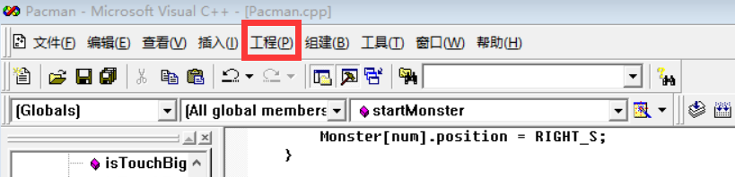
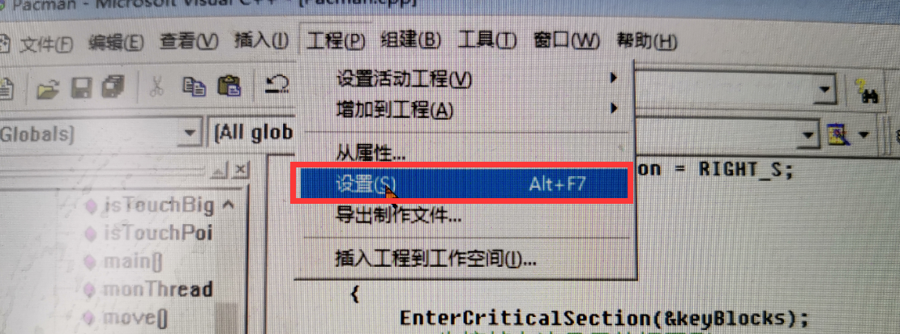
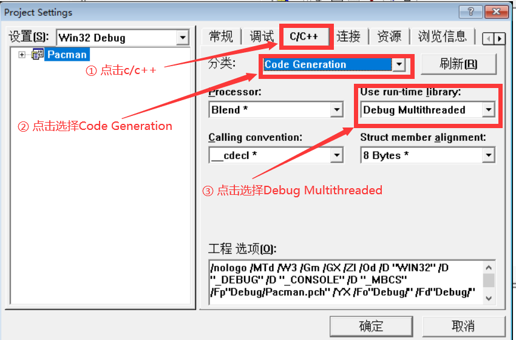

# PacMan--
软工专业大一下学期期末实训课小的游戏项目，使用easyX和多线程实现
# 用vc++6.0打开项目源代码的注意事项

### 由于项目需要用到多线程，所以需要在vc++中配置多线程的编程环境

#### 1.打开vc后点击上边工具栏里的工程

#### 2. 点击工程后会出现下拉栏，然后选择设置

#### 3. 然后出现以下图片，此时点击c/c++，然后点击分类右边的选择栏，选择Code Generation，然后再点击Use run-time library下拉栏里的Multithreaded、Debug Multithreaded中的任一个

#### 4. 最后点确定就可以正常运行代码了
